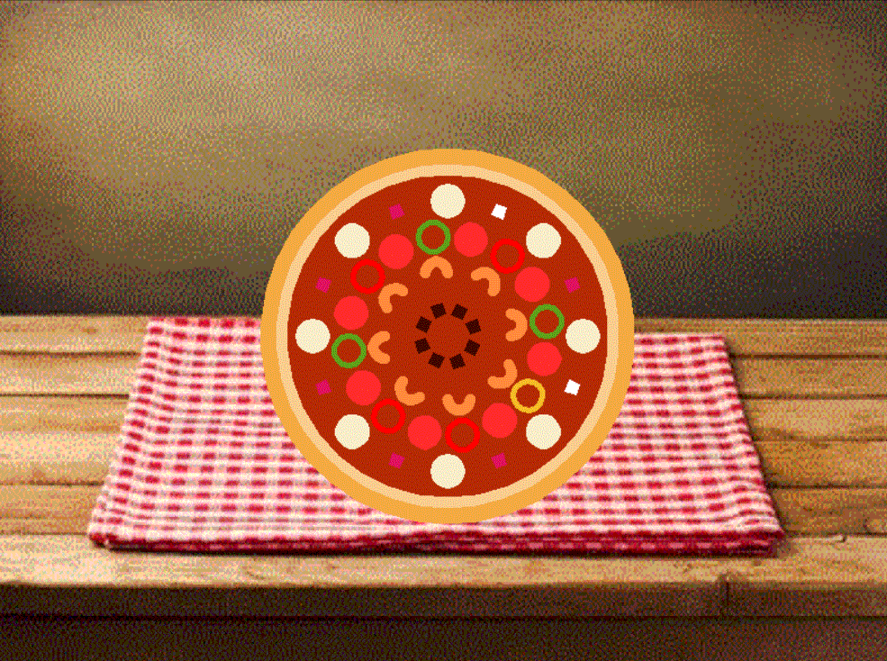
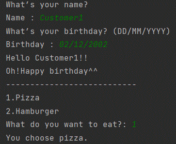
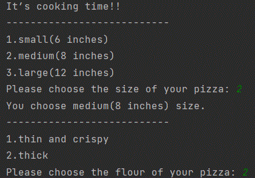
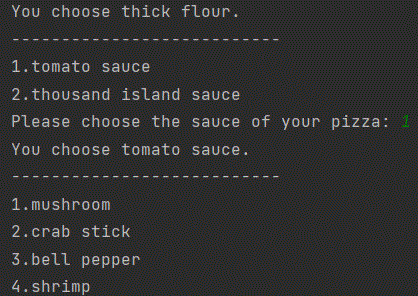
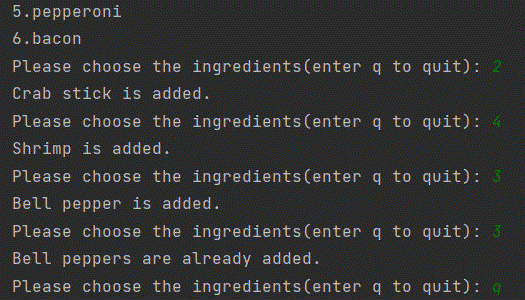
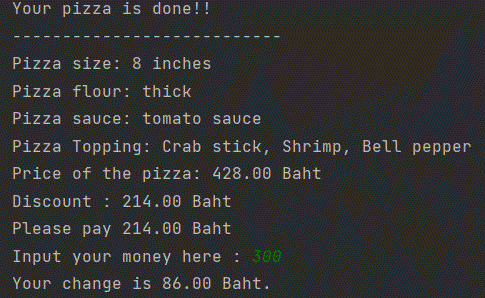
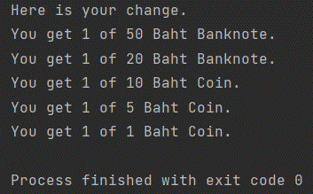
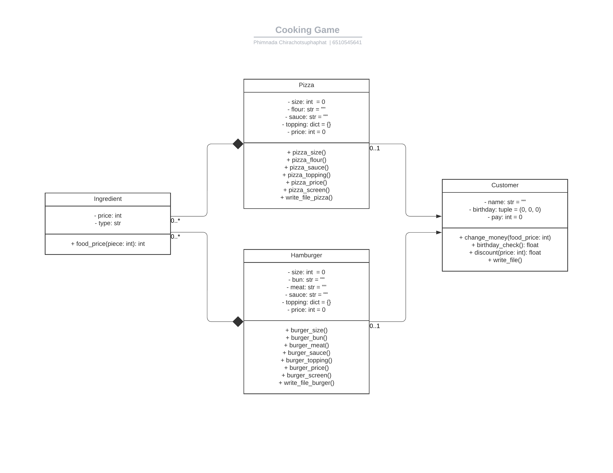

# Cooking Game
This Program is a project for Computer Programming 1 Course.
It is inspired by food preferences and gaming preferences.
### Overview and features
Customers can choose to make the pizza or hamburger they desire in this game. 
Additionally, there is a system in place to offer discounts to customers whose birthday or month of birth falls on the same day as their visit to purchase food.

### How to use and play?
1. Enter your name and birthdate before selecting the menu you want to purchase.
2. Choose from that menu's size, flour, sauce, and topping options.
3. The cost of the menu you have chosen will be shown when you have completed picking.
4. Enter the amount you will pay.
5. The amount of change you will get is shown.

### Program's Requirement
There are **4** Python modules & libraries required in the program.
* [turtle](https://docs.python.org/3/library/turtle.html) : utilized to create the menu graphics.
* [json](https://docs.python.org/3/library/json.html?highlight=json#module-json) : utilized to keep details such as the customer's name, birthdate, the menu they purchased, and their purchase price.
* [time](https://docs.python.org/3.11/library/time.html) : utilized to determine whether or not the customer's birthday or month of birth matches the date of purchase.
* [random](https://docs.python.org/3/library/random.html) : utilized to make some toppings' colors random.
### Program Design
There are **4** classes in this program.
* **Pizza** : This class is used to select pizza ingredients, calculate pizza ingredient prices, create pizza screens, and write pizza size and ingredient files.
* **Hamburger** : This class is used to select hamburger ingredients, calculate hamburger ingredient prices, create hamburger screens, and write hamburger size and ingredient files.
* **Ingredient** : This class is used to calculate the cost of each ingredient on that menu.
* **Customer** : This class is used to compute customer change, pay amount, and discount, as well as write customer data files. 

### Code Structure
* [main.py](main.py) : Run Main Program.
* [Pizza.py](Pizza.py) : Contains Pizza Class.
* [Hamburger.py](Hamburger.py) : Contains Hamburger Class.
* [Ingredient.py](Ingredient.py): Contains Ingredient Class.
* [Customer.py](Customer.py) : Contains Customer Class.
* [pizza.json](pizza.json) : Contains pizza's data(size, flour, sauce, topping, price of pizza).
* [burger.json](burger.json) : Contains hamburger's data(size, bun, meat, sauce, topping, price of hamburger).
* [customer.json](customer.json) : Contains customer's data(name, birthdate, price of food purchased of customer).
